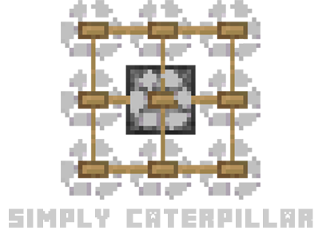
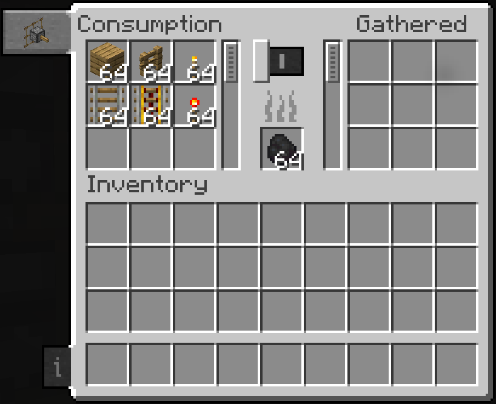
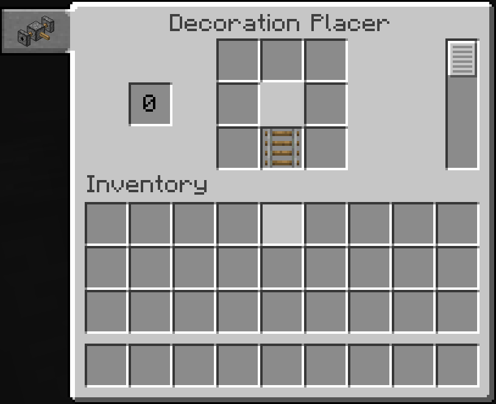
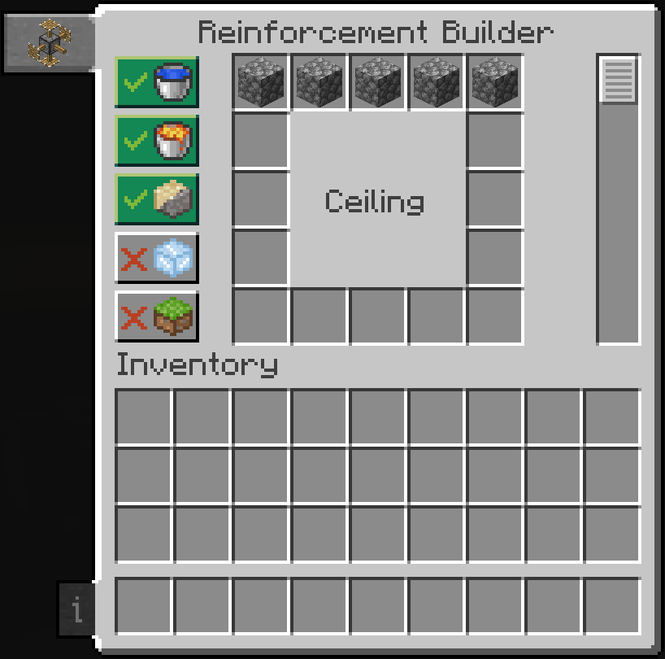

	

	<a href="https://github.com/The-Fireplace-Minecraft-Mods/Simply-Caterpillar" target="_blank">Source code</a>
    |
   	<a href="https://github.com/The-Fireplace-Minecraft-Mods/Simply-Caterpillar/issues" target="_blank">Issue tracker</a>

    
    

-------

**Simply Caterpillar** adds a drill that makes 3x3 mineshafts for you. You can add or not add any part to customize your drill.

## Features

	

		<h3>Drill base</h3>
		
This is the drill base, it's used for all parts.

	

	<h4>Recipe</h4>
	

	

		<h3>Drill head</h3>
		
This is the main part of the drill, it's used to drill and has the inventory for the drill.

	

	<h4>Screen</h4>
	
It has 18 slots of storage built in, and a fuel slot. Power can be toggled in the gui, and fuel consumption will pause when the caterpillar is turned off.

	
	<h4>Recipe</h4>
	

	

		<h3>Item Collector</h3>
		
Collects fallen items as it moves, and puts them in the caterpillar's inventory. Pretty useful if you don't want to manually pick up all blocks the drill breaks.

	

	<h4>Recipe</h4>
	

	

		<h3>Decoration placer</h3>
		
Builds the inside of the mineshaft.

	

	<h4>Screen</h4>
	
This is where you edit the decorations to be placed. By default, it places them similarly to the vanilla mineshafts.

	
	<h4>Recipe</h4>
	

	

		<h3>Reinforcement placer</h3>
		
Replaces gravel/sand, lava, water, and air in the square surrounding the mineshaft with the block of your choice.

	

	<h4>Screen</h4>
		
Edit the blocks used to reinforce the walls here and what gets replaced, so you can keep water, lava, sand, gravel, etc out of your mineshaft, or build yourself a floor to walk on, and walls and a ceiling if you wish.

	
	<h4>Recipe</h4>
	

	

		<h3>Incinerator</h3>
		
This allows you to destroy anything the caterpillar mines that you don't want, and save inventory space for what matters.

	

	<h4>Screen</h4>
	
Set anything you don't want to keep to be incinerated here.

	
	<h4>Recipe</h4>
	

	

		<h3>Storage</h3>
		
Adds 18 more slots to the drill head's inventory.

	

	<h4>Screen</h4>
	 
	<h4>Recipe</h4>
	

## Credits

- Daniel-Mendes
- The_Fireplace **[Twitter](https://twitter.com/The_FireplaceMC)** | **[Discord](https://discord.gg/CJ6pNEk)**
- freethemice
- Rumaruka
